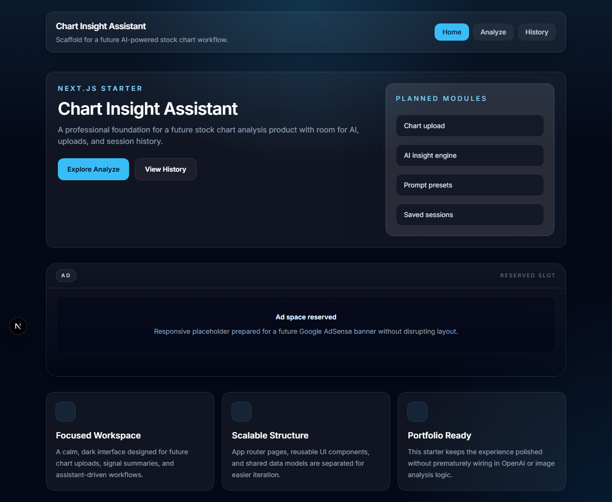
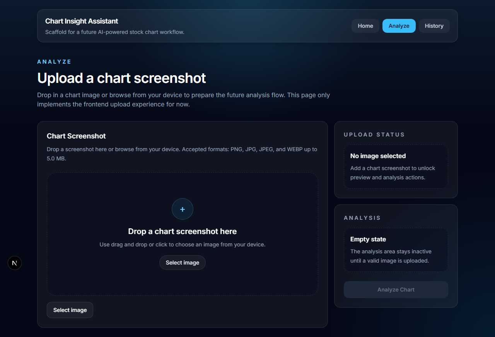
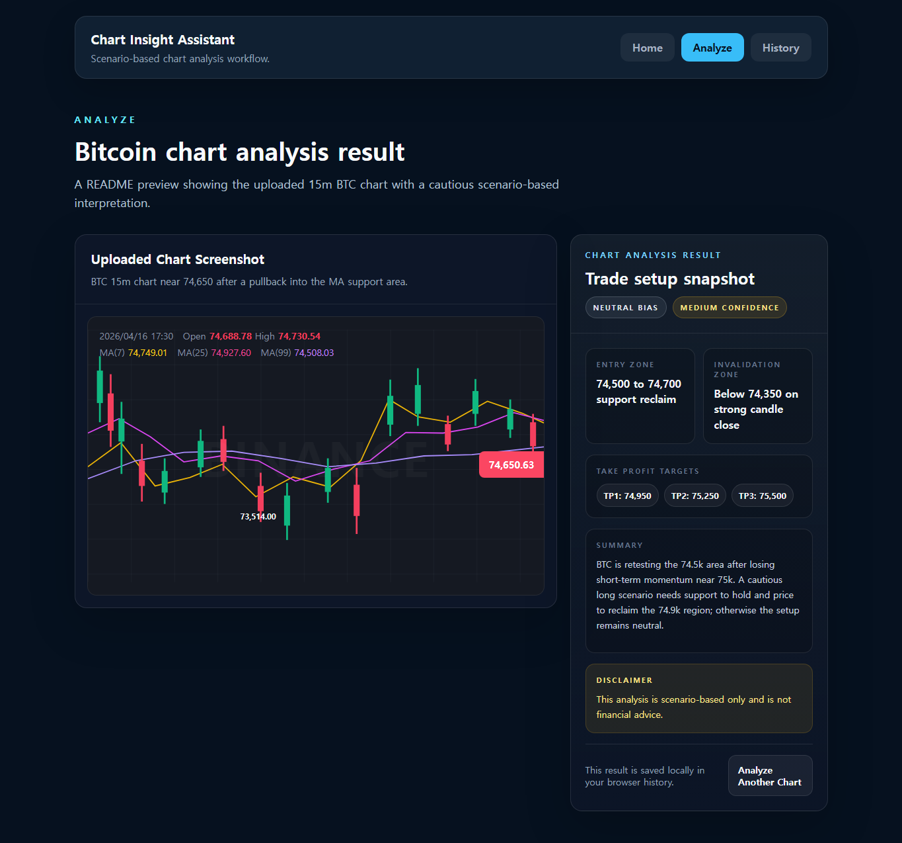
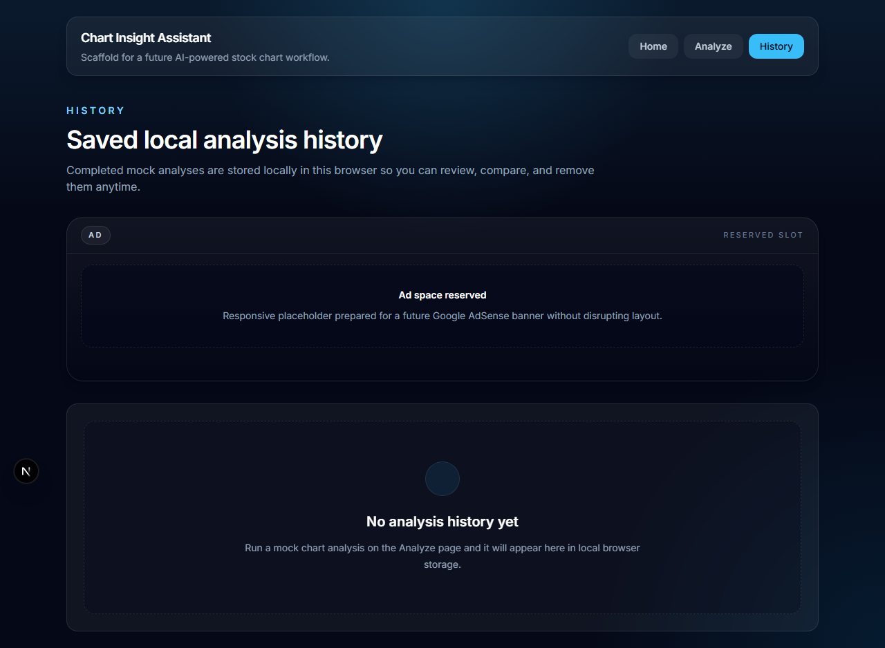

# Chart Insight Assistant

Chart Insight Assistant is a portfolio-ready Next.js application for uploading chart screenshots, generating cautious OpenAI-powered market interpretations, and saving analysis history locally in the browser. It is designed as a clean product foundation rather than a one-off demo: the UI is dark, responsive, extensible, and ready for future monetization with Google AdSense.

[English](./README.en.md) | [한국어](./README.ko.md) | [日本語](./README.ja.md)

## Preview

| Home | Analyze | Analysis Result | History |
| --- | --- | --- | --- |
|  |  |  |  |

## Why This Project

Many trading tools either stop at a simple image upload or return vague AI text without a usable product structure. Chart Insight Assistant focuses on the full user flow: upload a chart screenshot, validate it, send it to a server-side OpenAI route, display a structured result, save the result locally, and leave room for future deployment and monetization.

The app intentionally keeps the analysis cautious. It provides scenario-based interpretation only, avoids guaranteed predictions, and includes a financial advice disclaimer in the result UI.

## Core Features

- Chart screenshot upload with drag-and-drop and file picker support
- Client-side image preview before analysis
- PNG, JPG, JPEG, and WEBP validation with file size limits
- Server-side image validation before calling OpenAI
- OpenAI Responses API integration through `app/api/analyze/route.ts`
- Structured JSON response shape for predictable UI rendering
- Polished analysis result card with bias, confidence, zones, targets, summary, and disclaimer
- Local browser history using `localStorage`
- Individual history item deletion
- Reusable dark-themed UI components
- Google AdSense-ready global script, ad banner component, and `public/ads.txt`
- English, Korean, and Japanese README documentation

## Analysis Flow

1. The user uploads a chart screenshot on the Analyze page.
2. The browser validates the file type and size.
3. The selected image is previewed in the UI.
4. The user clicks `Analyze Chart`.
5. The frontend sends the image to `/api/analyze` as form data.
6. The server validates the uploaded image again.
7. The server sends the chart screenshot to OpenAI with a cautious scenario-based prompt.
8. The API returns structured JSON.
9. The UI renders a result card and saves the result to local browser history.

## Expected Analysis Shape

```json
{
  "bias": "long | short | neutral",
  "entry_zone": "string",
  "invalidation_zone": "string",
  "take_profit": ["string"],
  "confidence": "low | medium | high",
  "summary": "string"
}
```

## Tech Stack

| Area | Technology |
| --- | --- |
| Framework | Next.js App Router |
| Language | TypeScript |
| UI | React, Tailwind CSS |
| AI | OpenAI Responses API |
| Storage | Browser `localStorage` |
| Ads | Google AdSense-ready setup |
| Deployment | Vercel-ready |

## Project Structure

```text
app/
  api/analyze/route.ts      OpenAI-powered chart analysis route
  analyze/page.tsx          Analyze page shell
  history/page.tsx          Local history page
  layout.tsx                Root layout and global AdSense script
  page.tsx                  Home page
components/
  ad-banner.tsx             Reusable AdSense-ready ad slot
  chart-upload-panel.tsx    Upload, preview, API call, and result UI
  layout/site-header.tsx    Top navigation
  ui/                       Small reusable UI components
lib/
  analysis-history.ts       localStorage history helpers
  utils.ts                  Shared utility helpers
public/
  ads.txt                   Google AdSense verification file
  readme/                   README screenshot assets
```

## Getting Started

1. Install dependencies.

   ```bash
   npm install
   ```

2. Create `.env.local`.

   ```bash
   OPENAI_API_KEY=your_openai_api_key_here
   NEXT_PUBLIC_ADSENSE_CLIENT=ca-pub-9057658678883484
   ```

3. Start the development server.

   ```bash
   npm run dev
   ```

4. Open [http://localhost:3000](http://localhost:3000).

## Environment Variables

| Name | Required | Purpose |
| --- | --- | --- |
| `OPENAI_API_KEY` | Yes | Used server-side by `/api/analyze` to call OpenAI |
| `NEXT_PUBLIC_ADSENSE_CLIENT` | Optional | Used by ad slots when live AdSense placement IDs are configured |

Never commit `.env.local` or real API keys. If a key was previously committed, rotate it before deploying.

## Available Scripts

| Script | Description |
| --- | --- |
| `npm run dev` | Start the local development server |
| `npm run build` | Create a production build |
| `npm run start` | Start the production server |
| `npm run lint` | Run Next.js linting |
| `npm run type-check` | Run TypeScript without emitting files |

## Deployment

This project is ready for Vercel deployment.

1. Push the repository to GitHub.
2. Import the repository into Vercel.
3. Add `OPENAI_API_KEY` to the Vercel environment variables.
4. Add `NEXT_PUBLIC_ADSENSE_CLIENT=ca-pub-9057658678883484` if you plan to use live AdSense slots.
5. Deploy the project.

## Security And Safety

- OpenAI calls are made from the server route only.
- The API key is read from `process.env.OPENAI_API_KEY`.
- Uploaded images are validated on both the client and server.
- The result card includes a clear disclaimer.
- Analysis is scenario-based and should not be treated as financial advice.

## AdSense Setup

- The global AdSense script is loaded in `app/layout.tsx`.
- The reusable ad slot lives in `components/ad-banner.tsx`.
- The verification file is available at `public/ads.txt`.
- Real ad slots require valid `data-ad-slot` values from Google AdSense.

## Roadmap

- Add authenticated user accounts
- Save analysis history to a database
- Add chart symbol and timeframe metadata
- Add user-defined analysis presets
- Add better mobile result comparison views
- Add production observability and rate limiting

## Disclaimer

This project is for educational and portfolio purposes. The chart analysis output is scenario-based and is not financial advice.
